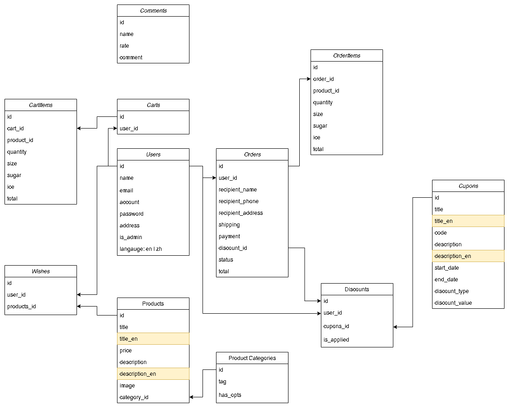

# CAFETERIA (NODEJS + MYSQL)

## Background / Purpose

The era of delivery has arrived due to the changing lifestyles of modern people. According to MIC's research on delivery services, usage stands at around 80%. To keep up with the times, The Cafe has decided to create its website with an ordering service to offer more choices for its clients.

The project is an optimized version of [AC Cafe](https://tonia83731.github.io/ACcafe-vite/), with the following imporvement:

- **Backend refactoring**: Replaced with a personally developed backend and database, enhancing stability and scalability
- **Role-Based Platform Split**: Provided separate frontend and backend stage for users based on their roles (public, user(members), staff), ensuring clear functionality and smooth operation
- **Data Storage Optimization**: Migrated Wishlist and Cartlist from LocalStorage to MySQL database, improving data access efficiency and consistency
- **Focused Purchase Process**: Removed the News page, simplifying content to allow users to focus more on ordering and shopping experiences
- **Multilingual Support**: Users can freely switch between Chinese and English interfaces based on their preferences
- **Coupon System**: Added a Coupon page and functionality, allowing users to apply discounts during checkout, enhancing purchase motivation
- **Enhanced Order Management**: Frontend and backend stage can now manage Order Status, allowing users to view order details and instantly update order statuses
- **Customization Options**: Added size, sweetness, and ice options for drink products, providing a more personalized ordering experience

### TABLE PLANNING



## TARGET USER

- Long-term customers who are accustomed to online ordering, especially those with a strong passion for coffee

- Busy office workers, freelancers or individuals who enjoy relaxing at home with a cup of coffee (tea)

## DEVELOPMENT

- For backend docs, please visit [cafeteria-documents](https://github.com/tonia83731/cafeteria-documents/blob/main/information-list.md)

- For frontend dev (client-staff), please visit [cafeteria-frontend-staff](https://github.com/tonia83731/cafeteria-frontend-staff)
- For frontend dev (client), please visit [cafeteria-frontend](https://github.com/tonia83731/cafeteria-frontend)

- For STAGE 1 (AC Cafe), please visit [ACcafe-vite](https://github.com/tonia83731/ACcafe-vite)

## PROJECT ROLES

- **Fullstack developer**: Provide API based on the requirements and visualized the result by developing an app

## CHALLENGES

- PROBLEM: **Issues with Imgur upload (503 Client Read Error):** The backend uses imgur@1.0.2 for image handling. It works fine locally but a 503 error occurs when deployed
  - SOLUTION: The issue has temporarily resolved by upgrading to imgur@2.4.3 and using Multer to handle image caching
  - RESOURCES: [https://israynotarray.com/nodejs/20220517/432259079/](https://israynotarray.com/nodejs/20220517/432259079/)
- PROBLEM: **Customized options handling (including size, ice, sugar, payment, shipping)**: Should these data be stored in a seperate table in the database?
  - SOLUTION: The current solution do not create a table for the options. Instead, numerical values are used to represent the options when selecting data.
  - For the planning outline, please visit [documentation](https://github.com/tonia83731/cafeteria-documents/blob/main/information-list.md)

## TOOLS

- express @4.17.1
- mysql2 @2.1.0
- sequelize @5.21.13
- sequelize-cli @5.5.1
- passport @0.4.1
- passport-jwt @4.0.0
- passport-local @1.0.0
- bcrypt @2.4.3
- cors @2.8.5
- jsonwebtoken @8.5.1
- multer @1.4.3
- imgur @2.4.3
- validator @13.12.0

## FURTHER DEVELOPMENT

- Consider integrating a third-party payment platform to provide **debit and credit card** payment options. Implement **3D verification** to ensure transaction security

- Consider adding an invoice binding feature, allowing users to select invoice information during checkout

- Consider adding an order notifications through email, providing a real-time updates and order detail

- Consider refactoring database to include custom options: size, ice, sugar, payment and shipping

## PROJECT SETUP

```sh
git clone https://github.com/tonia83731/cafeteria-backend.git
```

```sh
npm install
```

```sh
npm run dev
```
